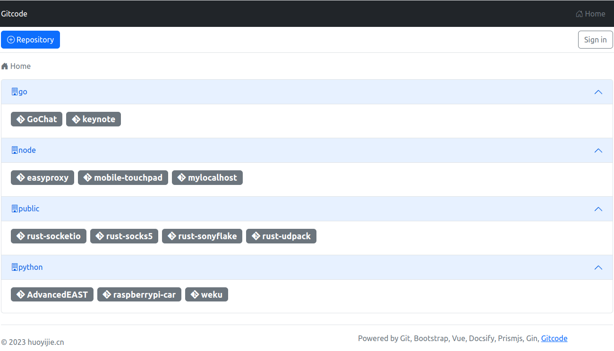
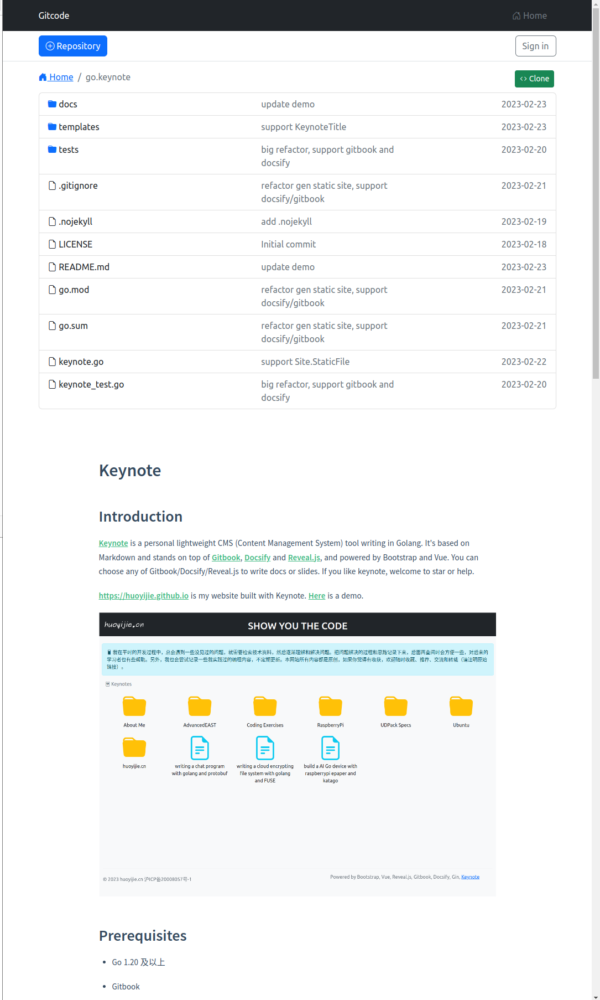
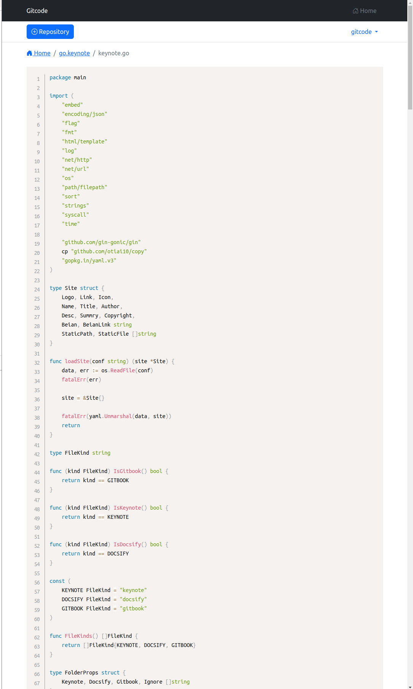

# Gitcode

## Introduction

[gitcode] is a personal lightweight self-hosted git server written in Go. It stands on top of git, go-git, and powered by Bootstrap, Vue, Docsify and Prismjs. It's about the same as gitweb now.

[My personal gitcodes](https://huoyijie.cn:1024)

## Features

* Support organization

e.g.: git clone `git@huoyijie.cn`:`go`/gitcode.git, gitcode.git repository stored in organization `go`

* Support new repository
* Support authorization by repository
* Browse or clone authorized code repositories
* Support markdown automatic rendering
* Support code highlighting







## Prerequisites

* Go 1.20+

## Install

```bash
$ git@github.com:huoyijie/gitcode.git

$ cd gitcode

$ go install .
```

```bash
$ gitcode -h
Usage of gitcode:
  -host string
    	the host that server listen on (default "127.0.0.1")
  -hostname string
    	the host name of the server (default "huoyijie.cn")
  -port int
    	the port that server listen on (default 8000)
  -repos string
    	the director where repos store (default "/home/git")
```

## Run gitcode

### server

Run gitcode manually
```bash
# Listen on 127.0.0.1:8787
$ gitcode -port 8787 -repos /home/git
```

Run gitcode as a service

Create a systemd config file `/etc/systemd/system/gitcode.service`
```conf
[Unit]
Description=Gitcode

[Service]
User=git
Group=git
Type=idle
Environment="GIN_MODE=release"
ExecStart=/home/ubuntu/go/bin/gitcode -port 8787 -repos /home/git
Restart=always
KillMode=process

[Install]
WantedBy=multi-user.target
```

Start gitcode service
```bash
$ sudo systemctl daemon-reload
$ sudo systemctl enable --now gitcode
```

View logs
```bash
$ systemctl -fu gitcode
```

### client

Access gitcode server through SSH tunnel
```bash
$ ssh -N -L 8787:127.0.0.1:8787 -o ServerAliveInterval=5 git@huoyijie.cn
```

Open `http://127.0.0.1:8787/` with the browser

In order to safely access gitcode througth the public network, you can configure nginx reverse proxy and TLS.

e.g.: [Demo](https://huoyijie.cn:1024)

## Authorization (based on casbin)

You can take a look at examples directory.

* RBAC model
```conf
[request_definition]
r = sub, obj, act

[policy_definition]
p = sub, obj, act

[role_definition]
g = _, _

[policy_effect]
e = some(where (p.eft == allow))

[matchers]
m = g(r.sub, p.sub) && r.obj == p.obj && r.act == p.act
```

* RBAC policy
```csv
p, role_admin, efs, read
p, role_admin, efs, write
p, role_admin, huoyijie, read
p, role_admin, huoyijie, write
p, role_guest, huoyijie, read
g, gitcode, role_admin
g, guest, role_guest
```

## TODO

* show binary files `done`
* show submodules `done`
* show breadcrumb `done`
* ssh proxy/ssh clone `done`
* render markdown/readme `done`
* create new repo `done`
* sign in/sign out/auth by role `done`

## Future

* code highlights, auto load script file
* show commits (very slow)
* show branchs/tags
* search repo
* search code
* issues
* pull request
* code diff
* merge request
* hook and build docker image
* publish with k8s